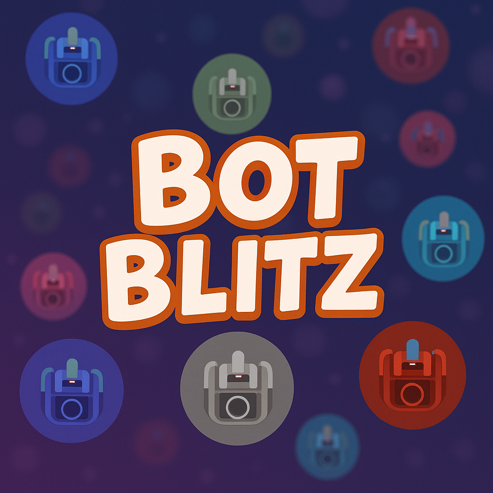

# Bot Blitz 🤖💥

Welcome to **Bot Blitz**, the electrifying match-3 game where you swap colorful robot parts against the clock! ⏱️

Get ready to match and blast your way through a grid of quirky robots. You've got just **two minutes** to rack up the highest score possible. Can you beat the clock and become the ultimate Bot Blitzer?

## 🚀 Features

- **Classic Match-3 Fun:** Swap adjacent bots to create lines of 3 or more identical bots.
- **Robotic Mayhem:** Match colorful robot parts in a vibrant grid.
- **Beat the Clock:** Race against a 120-second timer to maximize your score! ⏳
- **Score & Combo Tracking:** Watch your score climb and aim for the highest combo chain! ✨
- **Persistent Leaderboard:** You can see your Top 10 highest scores! 🏆 (Uses browser `localStorage`)
- **Sound Effects & Music:** Immersive sounds for swaps, matches, combos, and background music (with mute options!). 🎵
- **Responsive Design:** Playable on different screen sizes.
- **Built with Phaser 3:** Leveraging the power of the fun, free, and fast Phaser game framework.

## 🎮 How to Play

1.  **Start:** Open the [`index.html`](index.html) file in your browser.
2.  **Select & Swap:**
    - Click on a bot to select it (it will scale up).
    - Click on an adjacent (up, down, left, right) bot to swap them.
    - Alternatively, click and drag a bot towards an adjacent one to swap.
3.  **Match:** If the swap creates a line of 3 or more identical bots (horizontally or vertically), they'll be destroyed, and new bots will fall into place.
4.  **Score:** Earn points for every match. Matching more than 3 bots or causing chain reactions (combos) earns bonus points!
5.  **Time's Up!:** When the timer hits zero, the game ends, your score is saved, and you'll be taken to the records screen.

## 🛠️ How to Run Locally

1.  Clone or download this repository.
2.  Navigate to the project directory.
3.  Since the game loads local assets (images, sounds), you'll need to run it through a local web server for everything to work correctly due to browser security restrictions.
    - **Using VS Code:** Install the "Live Server" extension, right-click on [`index.html`](index.html), and choose "Open with Live Server".
    - **Using Python:** Open your terminal in the project directory and run `python -m http.server` (or `python3 -m http.server`) and then open `http://localhost:8000` in your browser.
    - **Using Node.js:** Install `http-server` globally (`npm install -g http-server`) and then run `http-server` in the project directory. Open the provided local address.
4.  Alternatively, you can simply open the [`index.html`](index.html) file directly in your browser, but sound loading _might_ be restricted depending on your browser settings.

## 💻 Tech Stack

- **HTML5:** Structure ([`index.html`](index.html), [`game.html`](game.html), [`leaderboard.html`](leaderboard.html))
- **CSS3:** Styling ([`assets/styles/index.css`](assets/styles/index.css), [`assets/styles/game.css`](assets/styles/game.css), [`assets/styles/leaderboard.css`](assets/styles/leaderboard.css))
- **JavaScript (ES6+):** Game logic and interactivity ([`game.js`](game.js), [`settings.js`](settings.js))
- **Phaser 3:** Core game framework ([`phaser.min.js`](phaser.min.js))

## 💡 Future Ideas

- Special bot types (bombs, line clears, color changers).
- Level progression or different game modes.
- More sophisticated scoring based on combo complexity.
- Backend integration for a global leaderboard.
- More animations and visual polish!

---

Happy Blitzing! 🎉
